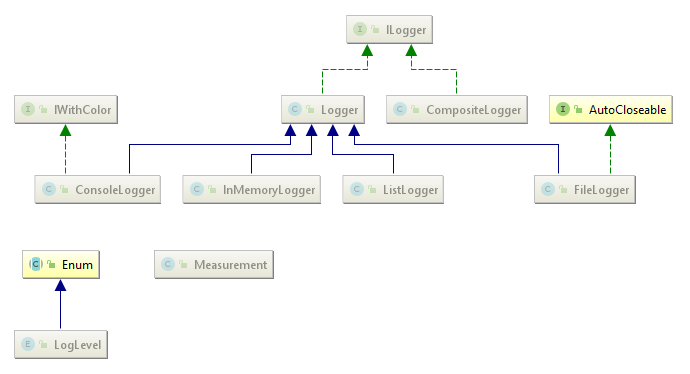
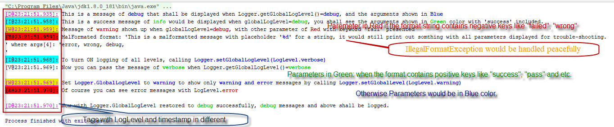
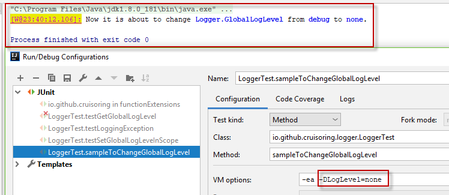
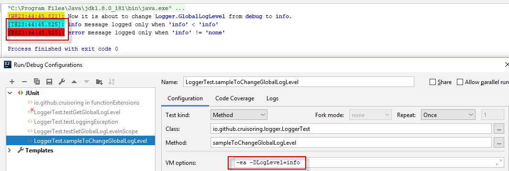
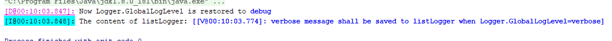
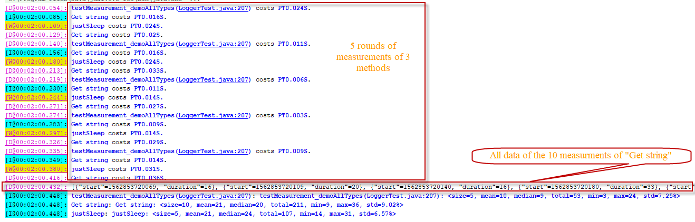

# functionExtensions.Logger

The [io.github.curuisoring.logger](https://github.com/Cruisoring/functionExtensions/tree/master/src/main/java/io/github/cruisoring/logger) package, build with FP paradigms, was added into [functionExtensions](https://github.com/Cruisoring/functionExtensions) with quite some unique features to empower software development with JAVA:
 *  Zero-config in most cases.
 *  Self-configurable means of logging to support any outputs and multiple outputs, simply by providing a String consumer.
 *  Error-prove, leveled logging of messages/exceptions with default colourful console outputs.
 *  Concise stack trace screening to show only meaningful call stacks.
 *  Logging messages highlight optional arguments in error/pass/normal states in different color by default.
 *  Logging ON/OFF by setting single static variables without changing source codes, or control minimum level to be logged in either logger or global level. 
 *  Build-in performance measurement support.
 
## Background

When working with a language like JAVA, the window that I watched most could be the the source code editor window, then spend the second to most of time to check the print-outs from the output window. Checking the logs could make my eyes sore quickly when the messages are too long, or containing too much details that shall be discarded at the first place and especially when I have to scrutinize the lengthy mono-coloured text to search some keywords, that shall be the initial key reason for me to develop this logging utility.

Unlike most other loggers, I have used static methods extensively to save time to initialize instances, turning logging on/off or redirecting to different media. When implementing some performance measurement utilities accepting Lambda expressions, I found it could be fitted well and that shall be a cheap means to tune your functions. 
 

## Architecture and Overview

The classes/interfaces diagram is shown below:



The only Enum type [LogLevel](https://github.com/Cruisoring/functionExtensions/blob/master/src/main/java/io/github/cruisoring/logger/LogLevel.java) defines 6 levels:
 *  `verbose, debug, info, warning, error` by referring [Android.log](https://developer.android.com/reference/android/util/Log) to tag the logged messages/exceptions.
 *  `none` is used mainly to turn off logging globally.

The [ILogger interface](https://github.com/Cruisoring/functionExtensions/blob/master/src/main/java/io/github/cruisoring/logger/ILogger.java) defines 4 methods to be implemented:
 *  `void save(String message)`: it is actually the only mandatory method to create a new Logger instance, as a Lambda to specify how to log a message.
 *  `LogLevel getMinLevel()`: specify the Minimum LogLevel, messages under it would be ignored by next method canLog().
 *  `boolean canLog(LogLevel level)`: determine if the given *LogLevel* shall be logged or not by check the Logger instance itself and global static settings.
 *  `String getMessage(LogLevel level, String format, Object... args)`: placeholder to specify how a message shall be created.
 
The *ILogger* interface has defined multiple default methods of following types:
 *  `ILogger log(LogLevel level, String format, Object... arguments)`: default method to log messages with optional arguments by: 
    * check and short-cut if logging is OFF or the message with given *LogLevel* shall not be logged by calling `boolean canLog(LogLevel level)`;
    * compose message by calling the `String getMessage(LogLevel level, String format, Object... args)` that can be personalised.
    * log the composed message by calling `void save(String message)`.
 *  `ILogger log(LogLevel level, Exception ex)`: default method to log exception by:
    * get stack trace of either the captured *Exception ex* itself, or its **cause** when available with assistance of [StackTraceHelper](https://github.com/Cruisoring/functionExtensions/blob/master/src/main/java/io/github/cruisoring/utility/StackTraceHelper.java) that shall effectively reduce hundreds lines of call stacks to dozens highlighting only the source codes of yours.
    * calling `ILogger log(LogLevel level, String format, Object... arguments)` to get the exception logged with stack trace highlighted.
 *  `verbose(Exception), verbose(String, Object...), debug(Exception), ... error(Exception), error(String, Object...)`: just syntactic sugar to feed above 2 log() methods with corresponding **LogLevel**s.
 *  Performance measurement methods to log single execution with explicit/implicit name that would be concluded by names. See later section.
 
The [Logger.java](https://github.com/Cruisoring/functionExtensions/blob/master/src/main/java/io/github/cruisoring/logger/Logger.java) is not only the base class implmenting *ILogger* interface, but also a hub holding several static variables/methods to enable zero-config loggings. For example:
 *  `static ILogger getDefault()`: returns the singleton *ILogger* instance which would be used by other static methods.
 *  `ILogger setDefault(Logger newLogger), LogLevel setGlobalLevel(LogLevel newLogLevel), LogLevel getGlobalLogLevel()`: can be used to replace the default *ILogger* instance, get/set global LogLevel to turn ON/OFF logging or log only certain levels of messages/exceptions.
 *  `Revokable<LogLevel> setLevelInScope(LogLevel newLogLevel)`: used with [try-with-resources](https://docs.oracle.com/javase/tutorial/essential/exceptions/tryResourceClose.html) to change the default logging behaviours withing the blocks.
 *  `ILogger V(Exception ex), ..., ILogger E(String format, Object... args)`: use the default *ILogger* instance to log message/exception with *LogLevel* of **verbose, debug, info, warning, error***[]: 
    * `ILogger V(Exception ex), ILogger V(String format, Object... args)` to log message or exception with **LogLevel.verbose**;
    * `ILogger D(Exception ex), ILogger D(String format, Object... args)` to log message or exception with **LogLevel.debug**;
    * `ILogger I(Exception ex), ILogger I(String format, Object... args)` to log message or exception with **LogLevel.info**;
    * `ILogger W(Exception ex), ILogger W(String format, Object... args)` to log message or exception with **LogLevel.warning**;
    * `ILogger E(Exception ex), ILogger E(String format, Object... args)` to log message or exception with **LogLevel.error**;
 *  `R M(Measurement.Moment startMoment, R value, LogLevel... levels), ILogger M(Measurement.Moment startMoment, RunnableThrowable runnable, LogLevel... levels), R M(Measurement.Moment startMoment, SupplierThrowable<R> supplier, LogLevel... levels)`: performance measurement APIs with the default *ILogger* instance that would be addressed later.
    
It is pretty simple to instantiate a new *Logger* instance by specifying a **Consumer<String>** and optional **LogLevel**, that means a SQL DB based Logger can be created with a method defining how a String to be saved.

The [ConsoleLogger](https://github.com/Cruisoring/functionExtensions/blob/master/src/main/java/io/github/cruisoring/logger/ConsoleLogger.java) would write the message to System console like `System.out::println`, that is also the default one to vivify the usually monochrome window with colorful tags and arguments to highlight key info for trouble-shooting.

The [InMemoryLogger](https://github.com/Cruisoring/functionExtensions/blob/master/src/main/java/io/github/cruisoring/logger/InMemoryLogger.java) and [ListLogger](https://github.com/Cruisoring/functionExtensions/blob/master/src/main/java/io/github/cruisoring/logger/ListLogger.java) use a [StringBuilder](https://docs.oracle.com/javase/7/docs/api/java/lang/StringBuilder.html) and a [TypedList<String>](https://github.com/Cruisoring/functionExtensions/blob/master/src/main/java/io/github/cruisoring/TypedList.java) to save message Strings to JAVA Object. The former would return a single String while the latter would return a List of Strings.

The [FileLogger](https://github.com/Cruisoring/functionExtensions/blob/master/src/main/java/io/github/cruisoring/logger/FileLogger.java) is a very simple implementation to enable saving logs to an external text file that shall be closed to save content to the file.

The [CompositeLogger](https://github.com/Cruisoring/functionExtensions/blob/master/src/main/java/io/github/cruisoring/logger/CompositeLogger.java) can be used to encapsulate multiple *ILogger* instances together to keep the same messages in different destinations, or can be used for testing purposed to validate the actual logging outputs while showing them in the console for example.

The *Logger* implemented with functions as its building blocks, thus separate the logic of logging from the actual persistent means. There is therefore no implementation difference between these Loggers, and following discussion would focus only on the Logger.default that is a **ConsoleLogger**. 

## Use Cases

### Logging with format and args

Conventionally, it needs to instantiate an Logger before using it in the source codes. Although it is possible to follow that convention to new a Logger then calling its instance methods defined in *ILogger* (**verbose(...), debug(...), info(...), warning(...), error(...)**), I prefer using the static methods calling the instance methods of **Logger.Default** directly. The following unit test shows how it works:

```
    @Test
    public void testLoggingOnOff_withAllLevels(){
        LogLevel globalLogLevel = Logger.getGlobalLogLevel();
        Logger.V("This is a message of %s that shall not be displayed when Logger.getGlobalLogLevel()=%s", LogLevel.verbose, globalLogLevel);
        Logger.D("This is a message of %s that shall be displayed when Logger.getGlobalLogLevel()=%s, and the arguments shown in %s", LogLevel.debug, globalLogLevel, "Blue");
        Logger.I("This is a success message of %s would be displayed when globalLogLevel=%s, you shall see the arguments shown in %s color with 'success' included.", LogLevel.info, globalLogLevel, "Green");
        Logger.W("Message of %s shown up when globalLogLevel=%s, with other parameter of %s with keyword 'fail' presented", LogLevel.warning, globalLogLevel, "Red");
        Logger.E("This is a malformatted message with placeholder '%d' for a string, it would still print out somthing with all parameters displayed for trouble-shooting.\n", LogLevel.error, "wrong", globalLogLevel, "\r\n");

        //Set Logger.GlobalLogLevel to LogLevel.verbose to turn on most detail logging
        Logger.I("To turn ON logging of all levels, calling %s", "Logger.setGlobalLogLevel(LogLevel.verbose)");
        Logger.setGlobalLevel(LogLevel.verbose);
        Logger.V("Now you can pass the message of %s when Logger.getGlobalLogLevel()=%s\n", LogLevel.verbose, Logger.getGlobalLogLevel());

        //Set Logger.GlobalLogLevel to LogLevel.waring to show only warning and error messages
        Logger.setGlobalLevel(LogLevel.warning);
        Logger.I("No LogLevel.info message to be displayed");
        Logger.W("Set %s to %s to show only %s messages by calling %s", "Logger.GlobalLogLevel", LogLevel.warning, "warning and error", "Logger.setGlobalLevel(LogLevel.warning)");
        Logger.E("Of course you can see error messages with LogLevel.%s\n", LogLevel.error);

        //Set Logger.GlobalLogLevel to LogLevel.none to turn off logging
        Logger.I("To turn OFF logging of all levels, calling %s\n", "Logger.setGlobalLogLevel(LogLevel.none)");
        Logger.setGlobalLevel(LogLevel.none);
        Logger.E("Now you shall not see any message, even if it is highest LogLevel %s", LogLevel.error);

        //Restore Logger.GlobalLogLevel to default LogLevel.debug
        Logger.setGlobalLevel(globalLogLevel);
        Logger.D("Now with Logger.GlobalLogLevel restored to %s successfully, %s messages and above shall be logged.", globalLogLevel, LogLevel.debug);
    }
```
The output below shows how messages of differnt *LogLevel* would be shown with different colors, parameters in RED, GREEN or BLUE colors depending on if the format contains negative, positive keywords or not.



The above output shows several things:
 *  How you can locate the concerned messages of specific LogLevel by looking the tag colors, you can even dig into the codes to see how to setup your own color themes.
 *  The optional `args` fed into methods like `ILogger I(String format, Object... args)` would be highlighted with RED/GREEN/BLUE color given the `format` contains negative/positive/none keywords defined as `Logger.DefaultFailedKeywords` and `Logger.DefaultSuccessKeywords`.
 *  If the given `format` and `args` result in `IllegalFormatException` thrown by [String.format(String format, Object... args)](http://hg.openjdk.java.net/jdk8/jdk8/jdk/file/687fd7c7986d/src/share/classes/java/lang/String.java), a less-readable String would be logged instead of break the business logic.
 *  `Logger.setGlobalLevel(LogLevel.none)` can be called to turn OFF logging silently.

**NOTICE: when feeding these methods with optional `args`, ensure there is no intensive calculations happened to slow your program.** 

### Logging Exceptions

Logging could be most useful at trouble-shooting Exceptions unexpected, but searching lengthy logs is really tedious especially when there are hundreds of lines are of JAVA JDK calls. The methods of logging Exceptions would usually show only relevant lines of your codes to make locating source of errors much easier.

The only difference when using different *LogLevel* to log Exceptions is that the higher the *LogLevel*, the less call stacks would be shown. However, a bottom line is that the root cause and the direct caller of the `Log.X` would be displayed. As the sample below involving 100+ `StackTraceElement`s illustrated:
```
    void recursiveToThrow(int count){
        if(--count == 0){
            try {
                count = count / count;
            } catch (Exception e) {
                throw new IllegalStateException(e);
            }
        } else {
            recursiveToThrow(count);
        }
    }

    @Test
    public void testLoggingException(){
        LogLevel globalLogLevel = Logger.setGlobalLevel(LogLevel.verbose);
        try {
            recursiveToThrow(100);
        } catch (Exception e) {
            Logger.V(e);
            Logger.D(e);
            Logger.I(e);
            Logger.W(e);
            Logger.E(e);
        }
        Logger.setGlobalLevel(globalLogLevel);
    }
``` 

")

The output above shows the positions of the relevant `StackTraceElement` to allow you estimate how deep the erroneous call stack could be, clicking the link of the last one (in this case with index of 100) would bring you to the source immediately.

### Global switch of logging

With this logging utility, especially by calling its static methods only, the `Logger.GlobalLogLevel` could be used as a switch to turn ON or OFF the logging, or allow only important events to be logged. Then it is extremely easy to call following method in your bootstrap method:
```
    @Test
    public void sampleToChangeGlobalLogLevel(){
        String logLevelString = System.getProperty("LogLevel");

        if(logLevelString != null) {
            LogLevel runtimeLogLevel = StringHelper.parse(logLevelString, LogLevel.class, LogLevel.debug);
            Logger.W("Now it is about to change %s from %s to %s.", "Logger.GlobalLogLevel", Logger.getGlobalLogLevel(), runtimeLogLevel);
            Logger.setGlobalLevel(runtimeLogLevel);
        }

        Logger.V("%s message logged only when '%s' == '%s'", LogLevel.verbose, logLevelString, LogLevel.verbose);
        Logger.I("%s message logged only when '%s' < '%s'", LogLevel.info, logLevelString, LogLevel.info);
        Logger.E("%s message logged only when '%s' != '%s'", LogLevel.error, logLevelString, LogLevel.none);
    }
```

By specifying System Property "-DLogLevel=none", only a warning before calling `Logger.setGlobalLevel()` is logged:



Similarly, setting it to "info" would show two messages of *info* and *error* respectively:



Without changing the source codes, the application shall behave differently with Runtime settings from command line, IntelliJ or TeamCity. 

**NOTICE: try not to call any methods to get the optional `args`, otherwise unexpected performace penalty might occur in the Logging methods even if Logger.GlobalLogLeve is set to none.** 

### Specifying LogLevel or Logger in specific scopes

Usually, it is preferred to log important messages above a concerned LogLevel. However, it is not unusual to expect details of specific methods for development or trouble-shooting with a small part of the application.

Then there are two static methods of *Logger* could help:
 *  `Revokable<ILogger> useInScope(ILogger newLogger)`: use an alternative means to keep logs in the concerned scope, then restore the default one after exiting that scope. 
 *  `Revokable<LogLevel> setLevelInScope(LogLevel newLogLevel)`: change the *LogLevel* temporarily in the concerned scope, then restore the default *LogLevel* after exiting that scope.
 
The output of the sample below shows how they are used and what to be logged:
```
    @Test
    public void testScopedLogLevelAndLogger(){
        ListLogger listLogger = new ListLogger();
        Logger.V("%s message shall not be dispalyed when Logger.GlobalLogLevel=%s", LogLevel.verbose, Logger.getGlobalLogLevel());
        try (
                Revokable<ILogger> loggerRevokable = Logger.useInScope(listLogger);
                Revokable<LogLevel> levelRevokable = Logger.setLevelInScope(LogLevel.verbose);
                ){
            Logger.V("%s message shall be saved to listLogger when Logger.GlobalLogLevel=%s", LogLevel.verbose, Logger.getGlobalLogLevel());
        }

        Logger.V("%s message shall not be dispalyed when Logger.GlobalLogLevel=%s", LogLevel.verbose, Logger.getGlobalLogLevel());
        Logger.D("Now Logger.GlobalLogLevel is restored to %s", Logger.getGlobalLogLevel());
        Logger.I("The content of listLogger: %s", TypeHelper.deepToString(listLogger.getMessages()));
    }
```



Following [try-with-resources](https://docs.oracle.com/javase/tutorial/essential/exceptions/tryResourceClose.html) pattern, enclosing the callings to the above two methods within `try()`, the codes within `{}` would log with the given *LogLevel* and *Logger* and that would be restored when exiting the block. This is enabled by [Revokable.java](https://github.com/Cruisoring/functionExtensions/blob/master/src/main/java/io/github/cruisoring/Revokable.java) that keeps a call-back method to be called when it is closed as an *AutoCloseable*. 

## Performance Measurement

This is actually backed by [Measurement.java](https://github.com/Cruisoring/functionExtensions/blob/master/src/main/java/io/github/cruisoring/logger/Measurement.java) by exploiting the sequence to evaluating a method call: its arguments would be evaluated from left to right first, before hand over the evaluated results to the actual called method.

Although all methods of *Meausrement* class are static and could be consumed as a stand-alone service, consuming them with 3 static methods of *Logger* would show performance figures displayed for free:

1. `R M(Measurement.Moment startMoment, R value, LogLevel... levels)`: evaluate the time to get the `value` of type `R` returned to its caller.
2. `R M(Measurement.Moment startMoment, SupplierThrowable<R> supplier, LogLevel... levels)`: measure time used to get value from the given SupplierThrowable.
3. `ILogger M(Measurement.Moment startMoment, RunnableThrowable runnable, LogLevel... levels)`: measure time used to execute the given RunnableThrowable.

All the 3 static methods would record time elapsed figures into Measurement with either customised name or default names `methodName(className:lineNumber)` with either specified or default *LogLevel*.

The measuring mechanism enabled by the *Meausrement* class is simple:
 *  The internal `Moment` class instance of `Measurement` keeps both label and created moment of the concerned performance measurements:
    * The `Moment start(String format, Object... args)` is used to compose the customised label just like `String.format(String format, Object... args)`;
    * Alternatively, `Moment start()` would check the current call stack to figure out the external caller of *Meausrement* class to compose a String of `methodName(className:lineNumber)`;
    * The `long System.currentTimeMillis()` is called finally to keep the time, that would also be when the `M(...)` starts evaluating the second argument.
 *  Some time shall be spend to get the `R value` by calling any function, or execute the business logic specified by either `SupplierThrowable<R> supplier` or `RunnableThrowable runnable`. The first two methods would return the evaluated strong-typed result to their callers, the 3rd one must be fed with `RunnableThrowable runnable` to evaluate a `void method(...)` since I cannot find any means to refer such method as a variable with JAVA.
 *  Once the *value* is supplied as either `R value` or `SupplierThrowable<R> supplier`, or the `RunnableThrowable runnable` is executed, the same `long System.currentTimeMillis()` would be called to create a [TupleRow](https://github.com/Cruisoring/functionExtensions/blob/master/src/main/java/io/github/cruisoring/table/TupleRow.java) instance to be inserted into a [TupleTable](https://github.com/Cruisoring/functionExtensions/blob/master/src/main/java/io/github/cruisoring/table/TupleTable.java)(that is an immutable strong-typed data structure) associated with the label to keep measured results (Currently only start and end time of two `Long`s).
 *  The optional `LogLevel... levels` is used to supply a specific *LogLevel*, or use `Logger.DefaultMeasureLogLevel` to log the performance figure.

Since the measurements are stored in [TupleTable](https://github.com/Cruisoring/functionExtensions/blob/master/src/main/java/io/github/cruisoring/table/TupleTable.java)s identified uniquely by the labels, there are some basic methods to retrieve the measured data:
 *  `Set<String> getMeasuredNames()`: get names of all measurements;
 *  `TupleTable getMeasurements(String name)`: extract all records of a serial of measurements by the shared label;
 *  `void purge(LogLevel level)`: Print out the existing performance summaries by name with given LogLevel, then clear.
 
The sample codes shows how to use it:

```
    <T> T withDelay(T value, long mills) {
        justSleep(mills);
        return value;
    }

    void justSleep(long mills) {
        try {
            Thread.sleep(mills);
        } catch (Exception e) {
        }
    }

    @Test
    public void testMeasurement_demoAllTypes(){
        Random random = new Random();
        for (int i = 0; i < 5; i++) {
            int next = random.nextInt(10);
            int v = Logger.M(Measurement.start(), withDelay(next, next));
            String nextString = Logger.M(Measurement.start("Get string"), withDelay(String.valueOf(next), next + 5), LogLevel.info);
            Logger.M(Measurement.start("justSleep"), ()->justSleep(random.nextInt(15)+10), LogLevel.warning);
            next = random.nextInt(20);

            nextString = Logger.M(Measurement.start("Get string"), withDelay(String.valueOf(next), next + 15), LogLevel.debug);
        }

        Logger.D(Measurement.getMeasurements("Get string").toString());

        Measurement.purge(LogLevel.info);
    }
```

The screenshot below shows how the measurments are reported, then all saved values of a serial of measurements with defined name can be extracted, and finally the summary of all measurements. Notice there are 4 `Logger.M()` calls, but 2 of them shares the same label `Get string`, so it has 10 records.



Just like calling `Logger.setGlobalLogLevel(none)` would turn off logging, set `Measurement.DisableMeasurement` to `true` would short-cut any measure and logging operations, then the caller of the `Logger.M(...)` would get the result returned immediately.

 
## Summary

This logger module applied FP concepts to bring conveniences for JAVA development and trouble-shooting with some innovative features:

*   Static Logger instance and methods to enable logging with zero-config.
*   Refrain `IllegalFormatException` caused by wrong format or args.
*   Only relevant Call stacks would be reported.
*   Enable customised Logging with a single Lambda expression.
*   Turn ON/OFF logging, or define levels of message/exception to be logged at run-time.
*   Hot-swap of Logging destination or LogLevel at global or scope level.
*   Default ConsoleLogger provides colorful tags and arguments.
*   Compact performance measurement embedded.

I hope this freeware can help you to solve some real problems associated with JSON or even data analysis.

If it does help you and you are happy, any support to the development of my church SIC would be really appreciated:

**A/C Name**: SIC Develmt Fund

**BSB**: 484 799

**A/C No**: 200 198 196